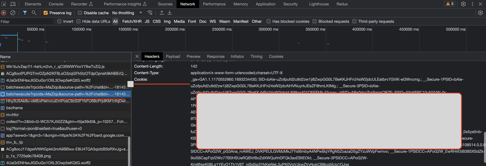

# Google Bard (beta) vscode extension

This is a vs code extension for [Google Bard(beta)](https://bard.google.com/).

> ***Google has not provided any open APIs for Bard, this extension is solely for entertainment and learning purposes.***

## Features

* Chat with [Google bard(beta)](https://bard.google.com/) in vscode
* Multiple answers for one question

  

    
    
  

## Extension Settings

* `vscode-bard.cookies`: Your Google Bard cookies.

## How to get cookies?

### Solution 1

* Go to <https://bard.google.com> and login.
* Open developer tools and go to `Application` tab.
* Click on `Cookies` and then `https://bard.google.com`.
* Search for `__Secure-1PSID` and copy the value.
* Paste the value `__Secure-1PSID={WHAT YOU COPIED}` in the extension settings `vscode-bard.cookies`.
* OR use shot cut `ctrl+shift+B` and paste the value.

  

### Solution 2

* Go to <https://bard.google.com> and login.
* Open developer tools and go to network tab.
* Click on any request of the host `bard.google.com` and copy the value of `Cookie` header.
* Paste the value in the extension settings `vscode-bard.cookies`.
* OR use shot cut `ctrl+shift+B` and paste the value.

  

> **Note:**
>
> * ***Remember to close the opened bard webpage after getting the cookie.***
>
> * ***Due to Google's security policy, different regions may require different cookies. You can try setting all cookies starting with __Secure-1, or copy the entire cookie value as in Solution 2***.

**Enjoy!**
